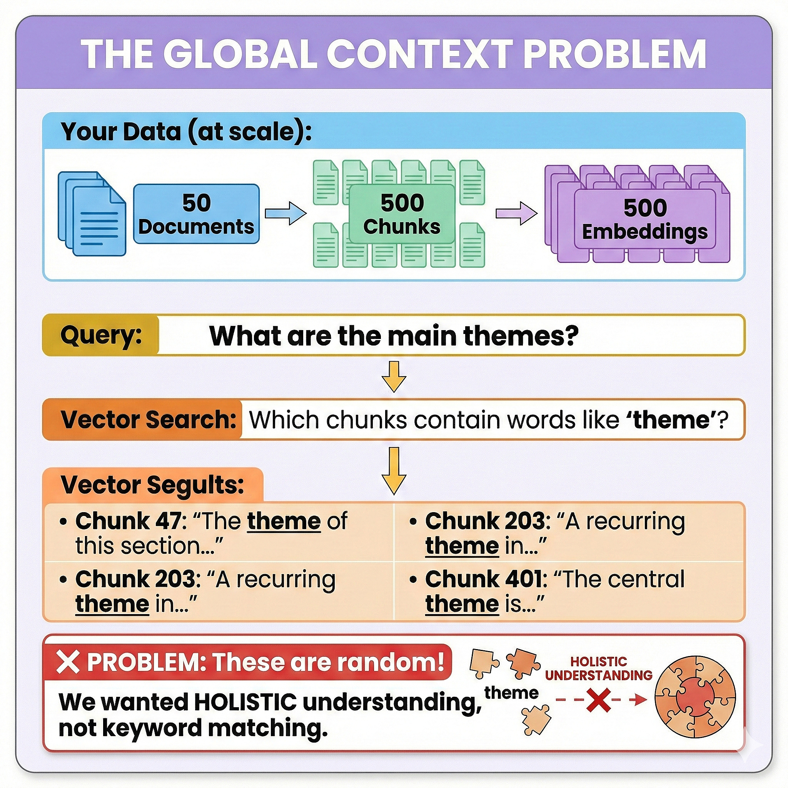
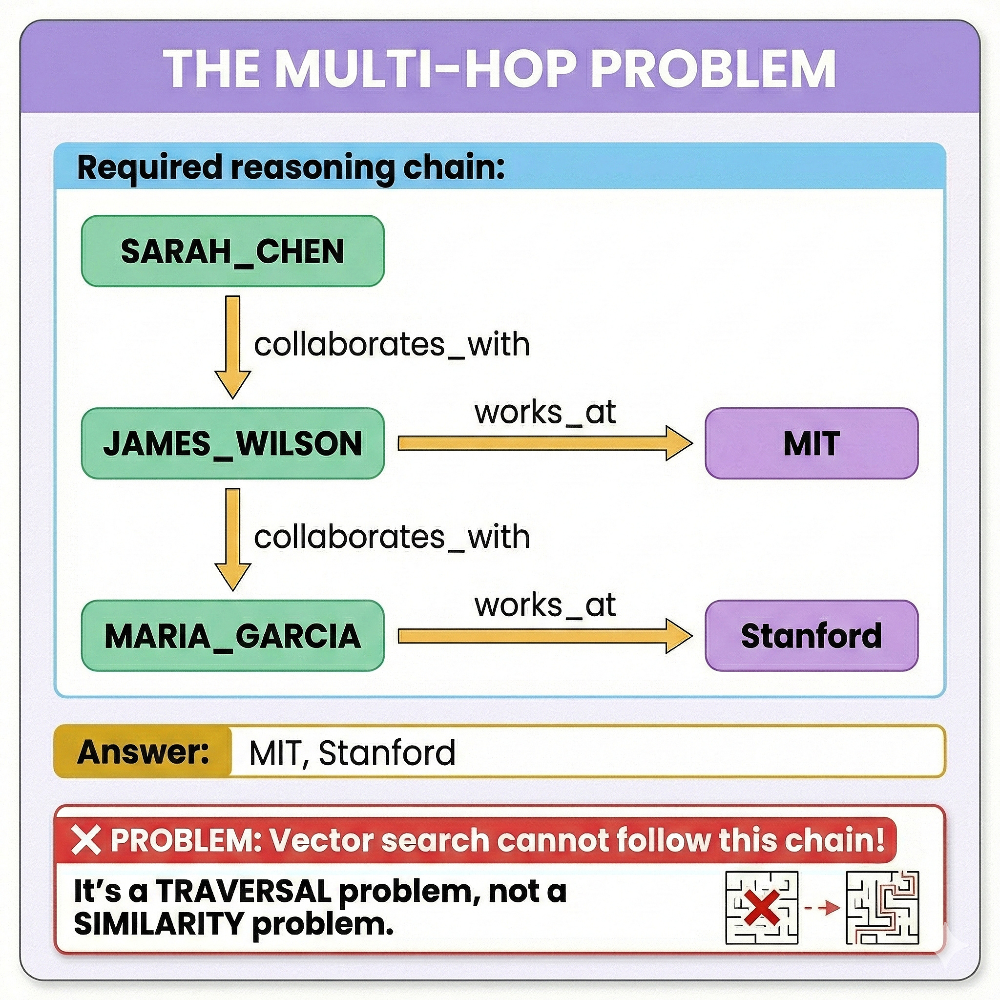
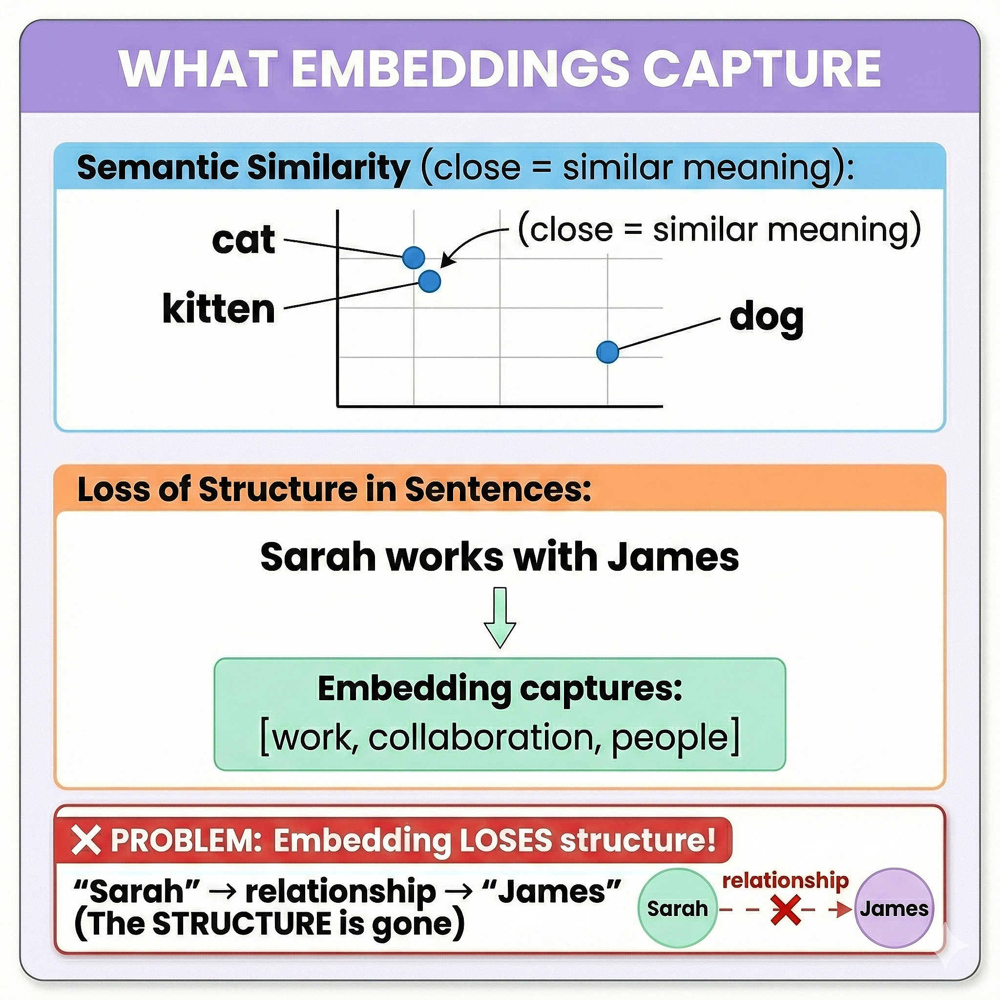
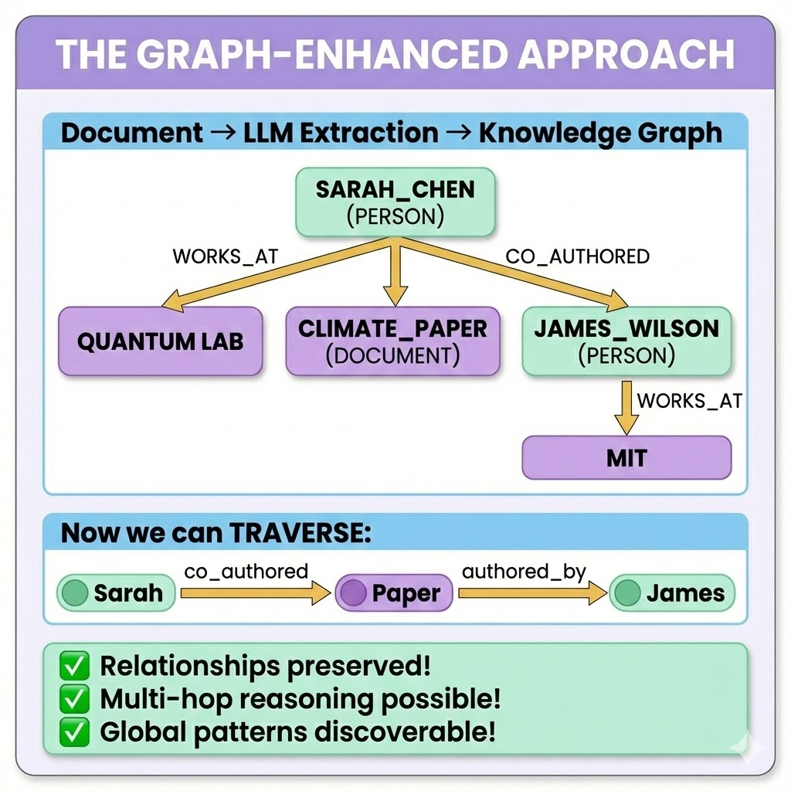
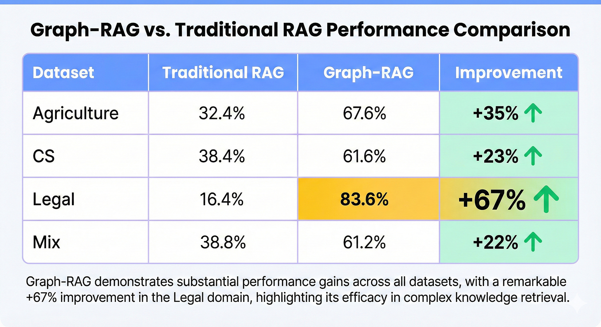
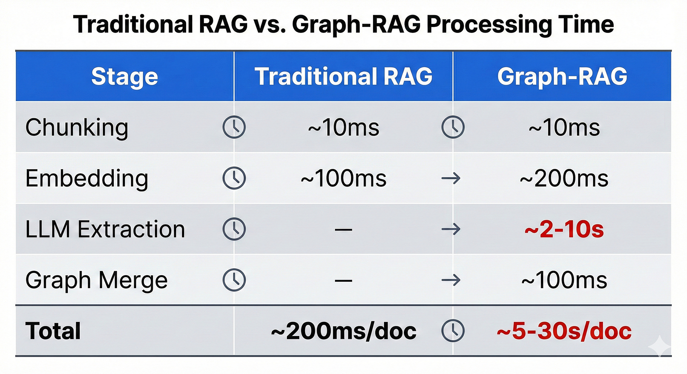

# Why Classic RAG Doesn't Work (And What To Do About It)

_The hidden flaw in vector search that's killing your AI's accuracy_

---

## The Promise vs. The Reality

You've heard the pitch: "Just chunk your documents, embed them, and let your LLM answer any question!"

Retrieval-Augmented Generation (RAG) was supposed to be the silver bullet. Ground your AI in your data. Eliminate hallucinations. Get accurate answers.

**So why does your RAG system keep giving you fragmented, incomplete answers?**

The truth is: **classic RAG has a fundamental flaw that no amount of prompt engineering can fix.**

---

## The Three Failures of Vector-Only RAG

### Failure #1: Lost Relationships

Consider this document about your company:

> "Sarah Chen works at Quantum Dynamics Lab. She authored the climate paper with Dr. James Wilson. The paper influenced the company's new sustainability initiative."

Now ask your RAG system: **"What is the connection between Sarah Chen and James Wilson?"**

Here's what happens internally:

The vector embeddings capture _semantic similarity_, but they don't capture _relationships_.

"Sarah" and "James" are just words in separate chunks. The fact that they _co-authored_ something together—that crucial connection—is invisible to vector search.

---

### Failure #2: No Global Understanding

Now try asking: **"What are the main themes across these 50 documents?"**

Classic RAG retrieves the chunks most similar to "main themes." But that's backwards.

Vector similarity is **local**—it finds similar _chunks_.

But "main themes" requires **global** understanding—seeing patterns across _all_ documents.

---

### Failure #3: No Multi-Hop Reasoning

The hardest questions require _chaining_ multiple facts:

**"Who are Sarah Chen's collaborators' organizations?"**

This requires:

1. Find Sarah Chen
2. Find her collaborators
3. Find their organizations

Classic RAG does a single vector lookup. It cannot "hop" from Sarah → collaborators → organizations.

---

## Why This Happens: First Principles

Let's go back to basics. What is a vector embedding?

**An embedding maps text to a point in high-dimensional space**, where _semantically similar_ texts are close together.

**Embeddings preserve meaning, but lose structure.**

When you chunk a document and embed the chunks:

- You preserve what each chunk is _about_
- You lose how chunks _connect_ to each other
- You lose explicit _relationships_ between entities

This is the fundamental limitation. And no prompt tuning, re-ranking, or chunk size optimization will fix it.

---

## The Solution: Knowledge Graphs

What if, instead of just embedding chunks, you also extracted _who_ and _what_ is mentioned—and how they relate?

This is **Graph-RAG**: combining vector search with knowledge graph traversal.

---

## Research Validation

This isn't just theory. The LightRAG paper (arxiv:2410.05779) demonstrated massive improvements:

_Comprehensiveness scores, measured by LLM-as-judge evaluation_

That's a **67% improvement** on legal documents—where relationships between entities (contracts, parties, clauses) are everything.

---

## The Trade-Off (And Why It's Worth It)

Graph-RAG requires more work at indexing time:

But consider:

- You index once, query forever
- The knowledge graph improves with every document
- Complex queries become possible (not just "possible but broken")

For any serious knowledge management system, this trade-off is a no-brainer.

---

## What's Next?

In the next article, we'll dive into **how EdgeQuake implements Graph-RAG**:

- The extraction pipeline (from text to graph)
- Entity normalization (why "John Doe" and "john doe" become one node)
- Dual-level retrieval (local entities + global themes)
- 5 query modes for different use cases

**EdgeQuake is a production-ready, Rust-based Graph-RAG framework** that brings these concepts to life with blazing performance.

→ [Star EdgeQuake on GitHub](https://github.com/raphaelmansuy/edgequake)

---

## TL;DR

1. **Classic RAG loses relationships** — Chunks are isolated, connections disappear
2. **Classic RAG has no global view** — Can't synthesize across documents
3. **Classic RAG can't chain reasoning** — Multi-hop questions fail
4. **Knowledge graphs solve this** — Entities + relationships = structure preserved
5. **The trade-off is worth it** — Index slower, query smarter

---

_This is Part 1 of the EdgeQuake Deep Dive series. Follow for more on building production Graph-RAG systems._

**Tags**: #RAG #GraphRAG #KnowledgeGraphs #LLM #AI #MachineLearning #EdgeQuake #Rust
