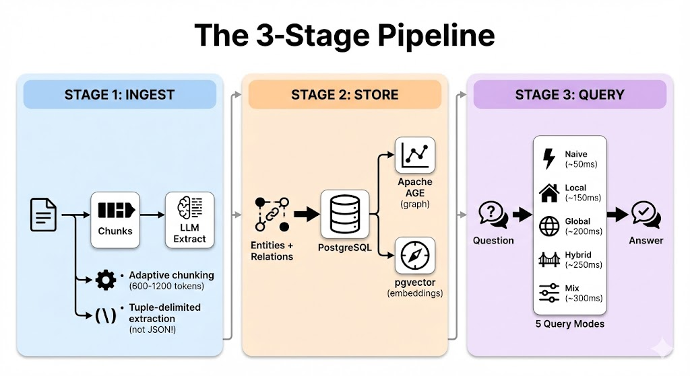

3 stages. 200ms queries. Zero Python.

That's EdgeQuake.

Here's how it transforms documents into knowledge graphs 👇

Most Graph-RAG implementations are:
• Research prototypes
• Python-bound (GIL limitations)
• Complex to deploy

EdgeQuake is different.

Built in Rust. Production-ready. Open source.

The 3-Stage Pipeline:



Why 5 query modes?

Different questions need different approaches:
• "Who is Sarah?" → Local (entity-centric)
• "Main themes?" → Global (community summaries)
• Complex queries → Hybrid (best of both)

Performance:
• <200ms query latency (hybrid)
• 1000+ concurrent users
• 2MB memory per document

The secret?

One database. PostgreSQL with:
→ Apache AGE for graph traversal
→ pgvector for embeddings

No Elasticsearch + Neo4j + Pinecone stack.
Just Postgres.

Getting started:

```
git clone github.com/raphaelmansuy/edgequake
make dev
```

Open http://localhost:3000.

That's it.

EdgeQuake is open source and ready for production.

→ Star the repo if you're building with Graph-RAG

What query mode would you use most? 👇

#GraphRAG #Rust #AI #LLM #KnowledgeGraphs #RAG
