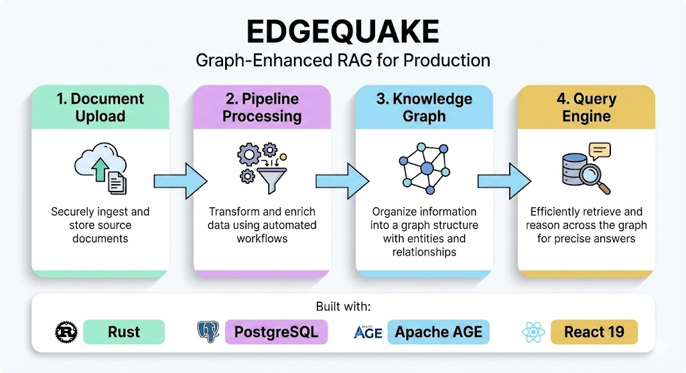
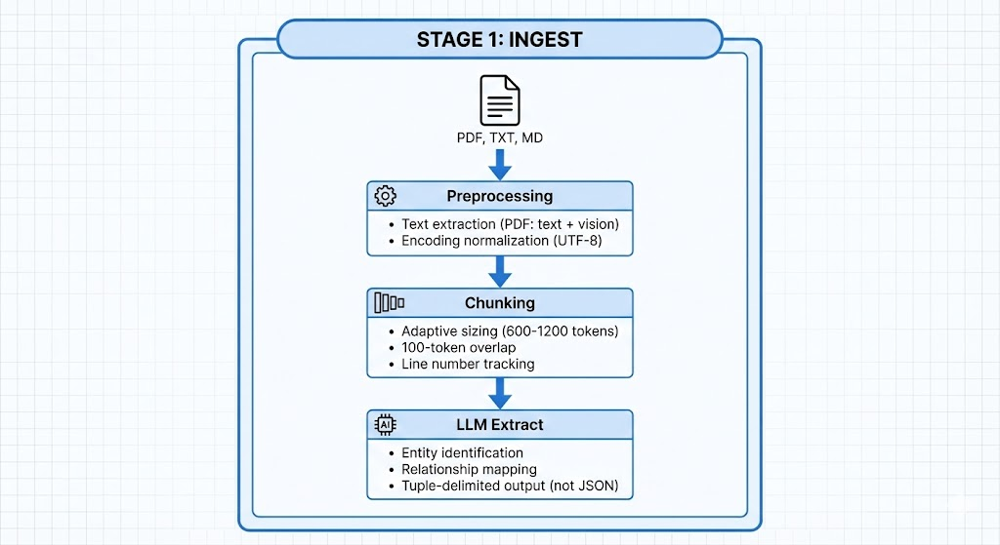
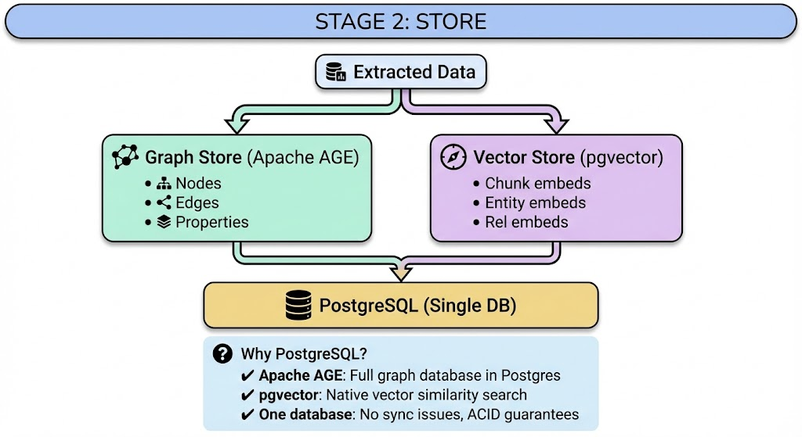
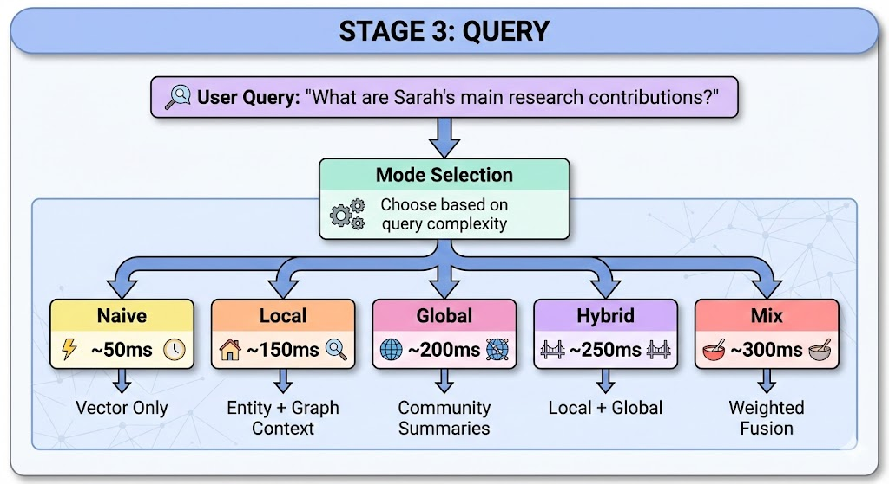
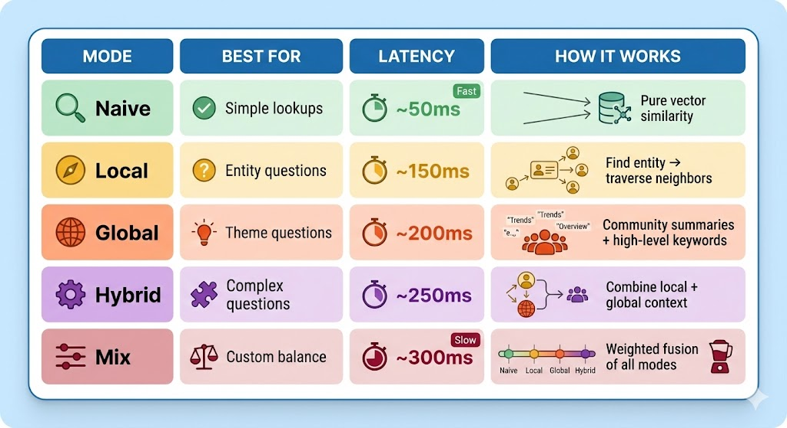
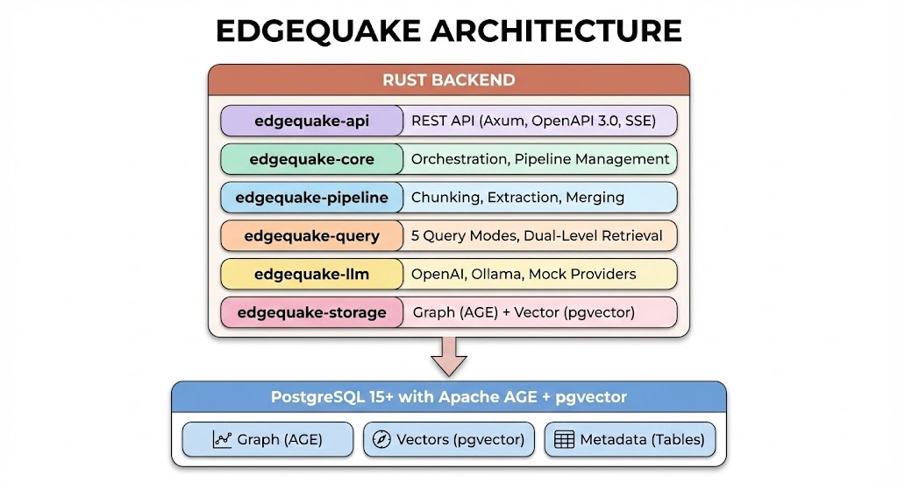
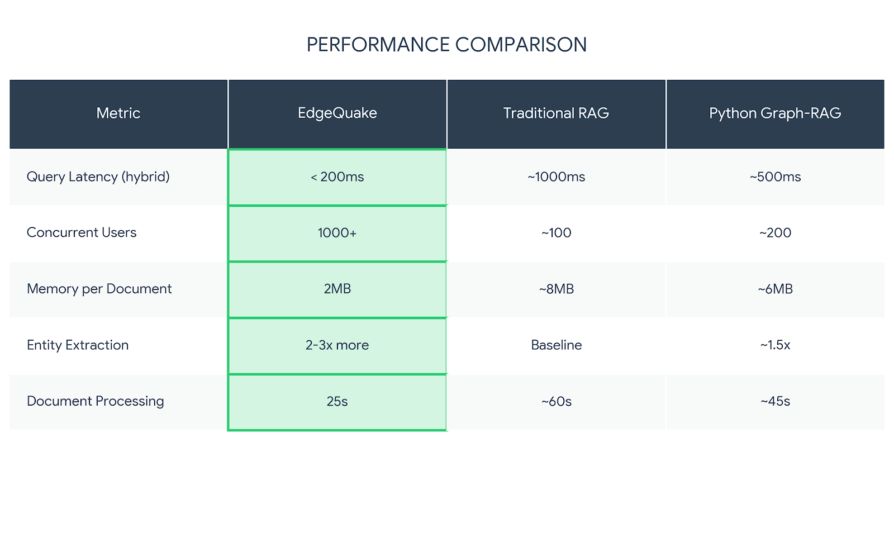

# The EdgeQuake Approach: Graph-First RAG in Rust

_From document to knowledge graph in 3 stages_

---

## The Problem We Solved

In [Part 1 of this series](./001_why_classic_rag_fails/medium.md), we explored why classic RAG systems fail:

- **Lost relationships**: Chunks are isolated, connections disappear
- **No global view**: Can't synthesize across documents
- **No multi-hop reasoning**: Complex questions go unanswered

The solution is clear: **knowledge graphs**. But implementing a production-ready Graph-RAG system? That's where things get complicated.

Until now.

---

## Introducing EdgeQuake

**EdgeQuake** is a high-performance Graph-RAG framework built from the ground up in Rust. It transforms your documents into a queryable knowledge graph—and it does it fast.




---

## The 3-Stage Pipeline

Every document in EdgeQuake flows through a battle-tested pipeline:

### Stage 1: Ingest

Documents enter the system and are prepared for extraction:




**Why tuple-delimited output?**

JSON parsing is fragile with LLMs. A single missing bracket breaks everything. EdgeQuake uses a battle-tested tuple format:

```
entity<|#|>SARAH_CHEN<|#|>PERSON<|#|>Lead researcher at Quantum Lab
entity<|#|>NEURAL_NETWORK<|#|>CONCEPT<|#|>Machine learning architecture
relation<|#|>SARAH_CHEN<|#|>NEURAL_NETWORK<|#|>researches<|#|>Sarah researches neural networks
<|COMPLETE|>
```

Line-by-line parsing. Partial recovery. No escaping nightmares.

---

### Stage 2: Store

Extracted entities and relationships flow into a hybrid storage layer:




**The key insight**: By using PostgreSQL with AGE and pgvector, we get graph traversal AND vector search in a single, battle-tested database. No Elasticsearch + Neo4j + Pinecone stack to maintain.

---

### Stage 3: Query

The query engine is where EdgeQuake shines. **5 distinct modes** for different use cases:




### Query Mode Breakdown



**Example**: "What are the main AI research trends?"

- **Naive**: Finds chunks mentioning "AI research trends" (may miss context)
- **Local**: Finds AI-related entities, expands to their relationships
- **Global**: Uses community detection to identify research clusters
- **Hybrid**: Combines entity context + community summaries for complete answer

---

## Architecture: Built for Production

EdgeQuake isn't a research prototype. It's designed for real-world deployment:




### Why This Architecture?

1. **Modular Crates**: Each component is independently testable and versioned
2. **Single Database**: PostgreSQL handles graph + vectors + metadata (no sync issues)
3. **LLM Agnostic**: Swap between OpenAI, Ollama, or custom providers
4. **Production Features**: Multi-tenant, streaming responses, health checks

---

## Performance: The Numbers

Built in Rust for a reason:



| Metric                 | EdgeQuake     | Traditional RAG | Python Graph-RAG |
| ---------------------- | ------------- | --------------- | ---------------- |
| Query Latency (hybrid) | **< 200ms**   | ~1000ms         | ~500ms           |
| Concurrent Users       | **1000+**     | ~100            | ~200             |
| Memory per Document    | **2MB**       | ~8MB            | ~6MB             |
| Entity Extraction      | **2-3x more** | Baseline        | ~1.5x            |
| Document Processing    | **25s**       | ~60s            | ~45s             |

---

## Getting Started: 3 Commands

```bash
# Clone the repository
git clone https://github.com/raphaelmansuy/edgequake.git
cd edgequake

# Install dependencies
make install

# Start the full stack (PostgreSQL + Backend + Frontend)
make dev
```

**That's it.** Open http://localhost:3000 and upload your first document.

---

## What's Next?

In the upcoming articles, we'll dive deeper into:

- **Entity Extraction**: How the LLM builds your knowledge graph
- **Query Engine**: The 5 modes explained in detail
- **Production Deployment**: From dev to scale
- **Cost Optimization**: $0.0014 per document processing

EdgeQuake is open source and ready for production.

→ [Star on GitHub](https://github.com/raphaelmansuy/edgequake)
→ [Documentation](https://github.com/raphaelmansuy/edgequake/tree/main/docs)
→ [Join the Discussion](https://github.com/raphaelmansuy/edgequake/discussions)

---

## TL;DR

1. **EdgeQuake** is a production-ready Graph-RAG framework in Rust
2. **3-stage pipeline**: Ingest → Store → Query
3. **5 query modes**: From ~50ms (naive) to ~300ms (mix)
4. **Single database**: PostgreSQL with AGE + pgvector
5. **Blazing fast**: <200ms hybrid queries, 1000+ concurrent users

_This is Part 2 of the EdgeQuake Deep Dive series. Follow for more on building production Graph-RAG systems._

**Tags**: #EdgeQuake #GraphRAG #Rust #KnowledgeGraphs #RAG #LLM #AI
