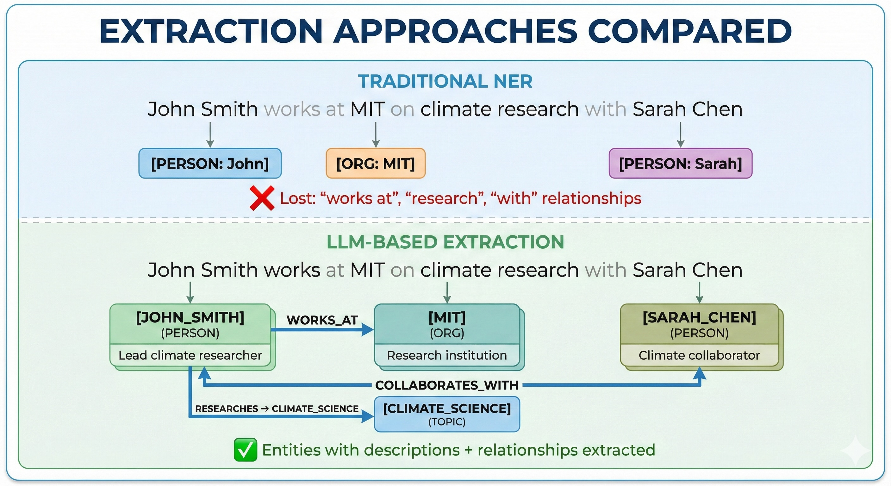
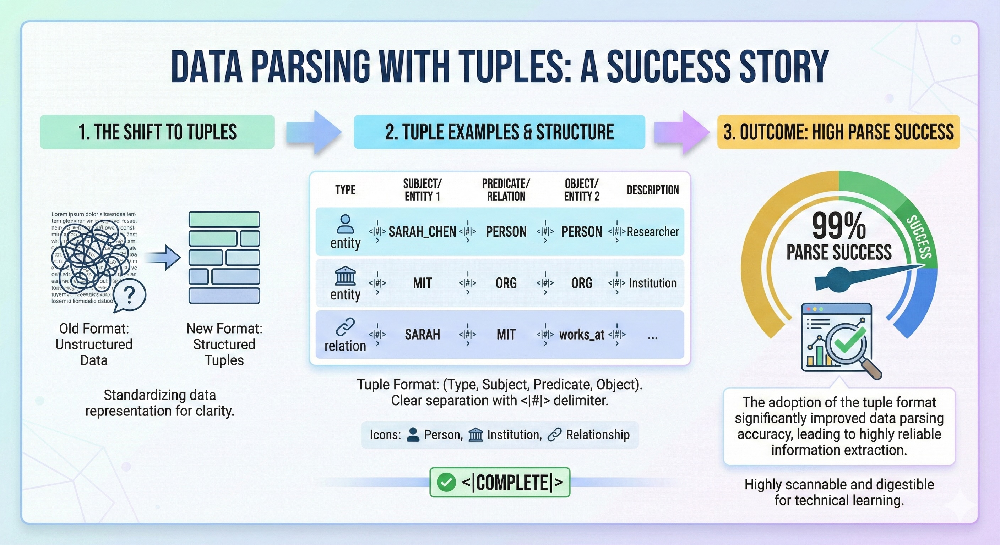
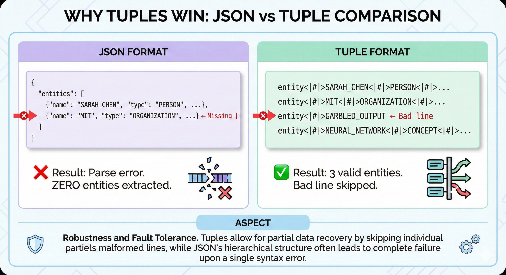
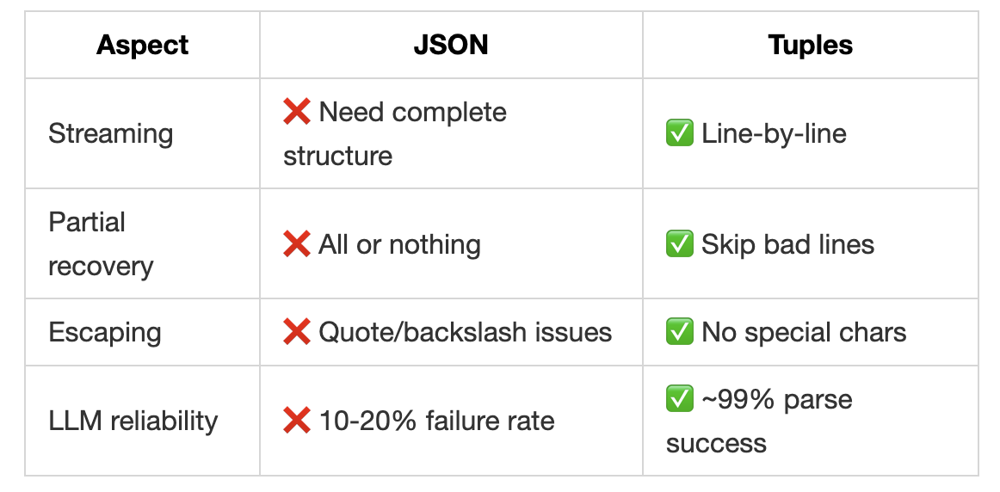
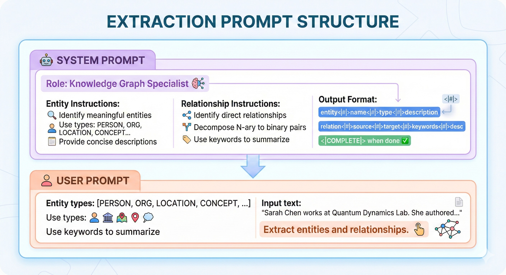
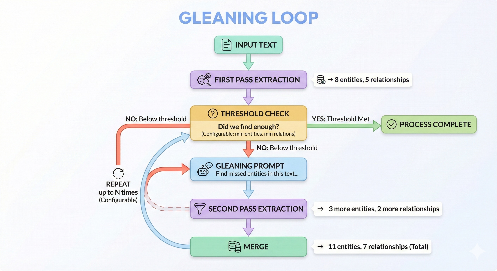
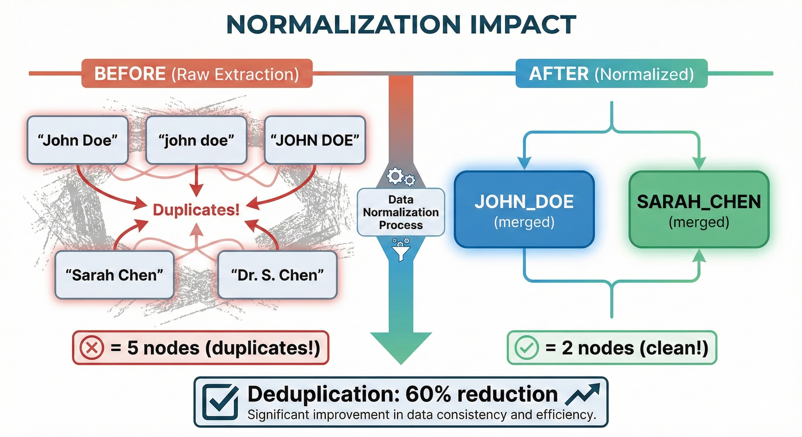
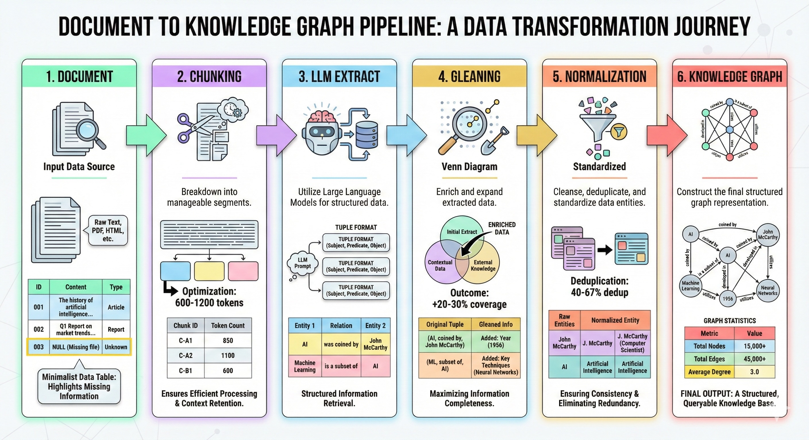
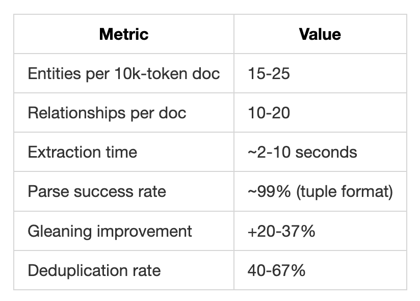

# How EdgeQuake Extracts Knowledge from Documents

Knowledge extraction is the foundation of any Graph-RAG system. It's how we turn unstructured text into structured entities and relationships that can be queried and reasoned over.

_LLMs as librarians: The entity extraction deep-dive_

---

## The Knowledge Extraction Challenge

You've got documents. Hundreds of them. Maybe thousands.

Inside those documents is knowledge: people, organizations, concepts, and the relationships between them. But that knowledge is locked up in paragraphs, buried in PDFs, scattered across formats.

Traditional approaches to extraction have two paths:

1. **Named Entity Recognition (NER)**: Fast, but shallow. Finds "John Smith" but not what makes John important.
2. **Manual extraction**: Accurate, but doesn't scale. Good luck with 10,000 documents.

EdgeQuake takes a third path: **LLMs as extraction engines**.

---

## The LLM Advantage

Here's the insight: Large Language Models are incredible at understanding context. They don't just recognize "John Smith" as a person—they understand that John is a _lead researcher_ who _collaborated_ with Sarah on the _climate paper_.





The LLM gives us:

- **Rich descriptions** (not just labels)
- **Explicit relationships** (not just co-occurrence)
- **Semantic understanding** (context-aware extraction)

And the best part? **No training required**. It works on legal documents, medical records, technical papers—any domain.

---

## The Tuple Format: Why We Ditched JSON

Here's something we learned the hard way: **JSON parsing with LLMs is fragile**.

Ask an LLM to output JSON, and 10-20% of the time you'll get:

- Missing closing brackets
- Unescaped quotes in descriptions
- Trailing commas
- Truncated output

One malformed character and your entire extraction fails.

EdgeQuake uses a **tuple-delimited format** instead:



### Why Tuples Win






This isn't theoretical—it's battle-tested from the LightRAG research and thousands of production extractions.

---

## The Extraction Prompt

The quality of extraction depends on the prompt. Here's what EdgeQuake sends to the LLM:




Key prompt engineering choices:

1. **Role definition**: "Knowledge Graph Specialist" focuses the LLM
2. **N-ary decomposition**: "Alice, Bob, and Carol collaborated" becomes 3 binary relationships
3. **Consistent naming**: Prevents duplicates like "Sarah" vs "Dr. Chen"
4. **Completion signal**: `<|COMPLETE|>` tells us when extraction is done

---

## Gleaning: Finding What Was Missed

First-pass extraction is good. But it's not perfect.

Complex documents have entities buried in context. The LLM might miss them on the first pass—especially with dense technical content.

EdgeQuake implements **gleaning**: iterative re-extraction for completeness.





**Results from production**:

- First pass: 8 entities
- After gleaning: 11 entities
- **37% more knowledge captured**

The trade-off is LLM cost, but for high-stakes domains (legal, medical, financial), the extra coverage is worth it.

---

## Normalization: Taming the Entity Explosion

Raw LLM output is messy. The same entity might appear as:

- "John Doe"
- "john doe"
- "JOHN DOE"
- "Mr. John Doe"
- "J. Doe"

Without normalization, each becomes a separate node in your graph. Your knowledge graph explodes with duplicates.

EdgeQuake normalizes entity names to a canonical format:

```rust
normalize_entity_name("John Doe")      → "JOHN_DOE"
normalize_entity_name("the company")   → "COMPANY"
normalize_entity_name("John's team")   → "JOHN_TEAM"
normalize_entity_name("Dr. Sarah Chen") → "DR_SARAH_CHEN"
```

The rules:

1. Convert to UPPERCASE
2. Replace spaces with underscores
3. Remove articles ("the", "a", "an")
4. Handle possessives and special characters
5. Trim and clean whitespace

**Before/After Comparison**:





In production, we see **40-67% deduplication rates**. That's the difference between a usable knowledge graph and a tangled mess.

---

## The Complete Extraction Pipeline

Putting it all together:




---

## Results: Real Numbers

From EdgeQuake production testing:



Compare to traditional NER:

- 2-3x more entities (with descriptions)
- Relationships included (NER gives you nothing)
- Domain-agnostic (no training needed)

---

## What's Next?

In the next article, we'll explore **Graph Storage Architecture**:

- How PostgreSQL + Apache AGE stores the knowledge graph
- Why one database beats three
- Query patterns for graph traversal

→ [Star EdgeQuake on GitHub](https://github.com/raphaelmansuy/edgequake)

---

## TL;DR

1. **LLMs beat NER** for extraction: richer descriptions, relationships included
2. **Tuple format is robust**: 99% parse success vs 80-90% with JSON
3. **Gleaning finds +20-30% more** entities through iterative re-extraction
4. **Normalization is critical**: 40-67% deduplication for clean graphs
5. **Domain-agnostic**: Works on any text without training

_This is Part 3 of the EdgeQuake Deep Dive series. Follow for more on building production Graph-RAG systems._

**Tags**: #EntityExtraction #NLP #KnowledgeGraphs #LLM #GraphRAG #EdgeQuake #Rust
