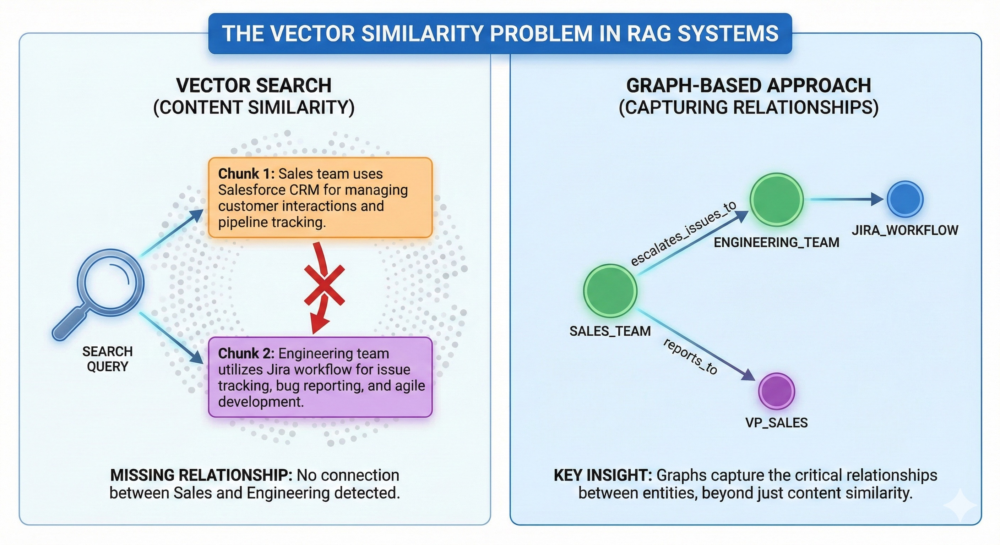
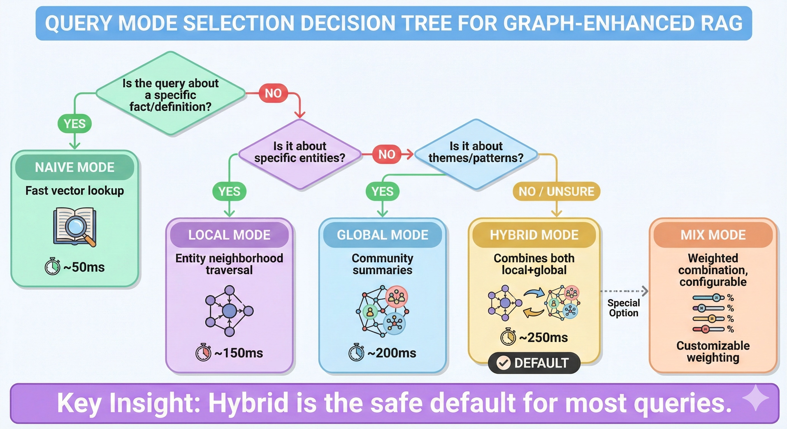

# Beyond Vector Search: How Graph-Enhanced Retrieval Transforms RAG

_Why your RAG system struggles with relationship questions—and how to fix it_

---

## The Query That Broke Everything

"How does the sales team collaborate with engineering on customer issues?"

Simple question. Our RAG system had ingested 500+ documents about our organization. Sales processes, engineering workflows, cross-team procedures—it was all there.

The answer we got: A rambling mess about sales metrics and engineering sprint planning. Two separate topics, zero connection between them.

The problem wasn't our documents. The problem was **how we retrieved them**.

---

## The Limitation of Vector Similarity

Traditional RAG uses vector similarity: embed the query, find similar chunks, stuff them into a prompt. It works brilliantly for questions like:

- "What is our return policy?"
- "How do I reset my password?"
- "What are the product specifications?"

These are **lookup questions**. The answer exists in a single chunk, waiting to be found.

But many real-world questions aren't lookups. They're **relationship questions**:

- "How does Alice collaborate with Bob?"
- "What's the connection between Project X and Department Y?"
- "Who influences the budget decisions?"

For these, vector similarity fails. Why?



---

## The 5 Query Modes

EdgeQuake doesn't force a one-size-fits-all retrieval strategy. Instead, it provides **5 query modes**, each optimized for different question types:

### Mode 1: Naive (Vector Similarity)

```
Query → Embed → Vector Search → Top-K Chunks → LLM
```

**Best for**: Factual lookups, specific definitions
**Speed**: ~50ms
**Example**: "What is our refund policy?"

Fast and effective for simple questions. But limited to chunk-level matches.

### Mode 2: Local (Entity-Centric)

```
Query → Extract Keywords → Find Entities → Traverse Neighbors → LLM
```

**Best for**: Entity relationship questions
**Speed**: ~150ms
**Example**: "What projects has Sarah Chen worked on?"

Starts with an entity (SARAH_CHEN), explores its neighborhood (projects, teams, reports), retrieves connected context.

### Mode 3: Global (Community-Based)

```
Query → Extract Themes → Find Communities → Aggregate Summaries → LLM
```

**Best for**: Broad thematic questions
**Speed**: ~200ms
**Example**: "What are the main challenges in our organization?"

Uses community detection to find clusters of related concepts, provides high-level summaries.

### Mode 4: Hybrid (Local + Global)

```
Query → Keywords → [Local Search] + [Global Search] → Merge → LLM
```

**Best for**: Complex, multi-faceted questions (DEFAULT)
**Speed**: ~250ms
**Example**: "How does the sales team collaborate with engineering?"

Combines entity-specific context (Local) with thematic overview (Global). The default because most real queries benefit from both.

### Mode 5: Mix (Weighted Combination)

```
Query → [Naive Weight] + [Graph Weight] → Configurable Blend → LLM
```

**Best for**: Custom tuning per domain
**Speed**: Varies by weights
**Example**: Domain-specific optimization

Maximum flexibility—tune the balance between vector similarity and graph traversal.

---

## Mode Selection Decision Tree



In practice, **Hybrid is the safe default**. It combines entity-specific precision with thematic coverage, handling the widest range of queries well.

---

## The LightRAG Algorithm

EdgeQuake implements the LightRAG algorithm (arXiv:2410.05779), which introduces a key innovation: **multi-level keyword extraction**.

### Step 1: Keyword Extraction

The query is analyzed by an LLM to extract two types of keywords:

```
Query: "How do sales and engineering collaborate on customer issues?"

High-Level Keywords (themes):
  - "cross-team collaboration"
  - "customer issue resolution"
  - "communication processes"

Low-Level Keywords (entities):
  - "sales team"
  - "engineering team"
  - "customer issues"
```

### Step 2: Level-Specific Retrieval

Each keyword level targets different storage:

```
High-Level → Relationship embeddings (Global mode)
             Find edges connecting concepts

Low-Level  → Entity embeddings (Local mode)
             Find nodes representing entities

Query      → Chunk embeddings (Naive mode)
             Direct similarity search
```

### Step 3: Context Aggregation

Results from all levels are merged, deduplicated, and ranked:

```rust
QueryContext {
    entities: [SALES_TEAM, ENGINEERING_TEAM, VP_OPERATIONS],
    relationships: [
        (SALES_TEAM, "escalates_to", ENGINEERING_TEAM),
        (VP_OPERATIONS, "oversees", COLLABORATION_PROCESS),
    ],
    chunks: [chunk_1, chunk_2, chunk_3],
}
```

---

## Token Budgeting: Never Overflow

A critical challenge: LLM context windows are finite. Stuff too much context, and you hit errors. Stuff too little, and answers lack depth.

EdgeQuake's solution: **smart token budgeting with priority**.

```rust
TruncationConfig {
    max_context_tokens: 4000,     // Stay under limit
    entity_priority: 0.4,         // 40% budget to entities
    relationship_priority: 0.3,   // 30% to relationships
    chunk_priority: 0.3,          // 30% to raw chunks
}
```

Graph context (entities + relationships) gets priority because:

1. **Pre-summarized**: Entity descriptions are condensed during ingestion
2. **Higher signal**: Relationships are explicit, not buried in text
3. **Unique value**: This context isn't available in naive RAG

---

## Keyword Caching: 10x Cost Reduction

Keyword extraction requires an LLM call. For repeated or similar queries, this adds up.

EdgeQuake caches extracted keywords:

```rust
KeywordCache {
    ttl: Duration::from_secs(24 * 60 * 60),  // 24 hours
    max_entries: 1000,
}
```

Same query within 24 hours? Skip keyword extraction entirely. Similar queries? Often hit cache for overlapping keywords.

In production, this reduces keyword extraction calls by 70-90%.

---

## Benchmarks: Mode Performance

On a knowledge base with 100,000 entities and 500,000 relationships:


_\*Quality measured by human evaluation on 1,000 queries_

Key insights:

- **Naive is 5x faster** but loses 2+ points on relationship queries
- **Hybrid is 30% slower** but consistently highest quality
- **Local excels** on entity-specific questions
- **Global excels** on thematic/pattern questions

---

## Production Patterns

### Adaptive Mode Selection

EdgeQuake can automatically select mode based on query intent:

```rust
SOTAQueryConfig {
    use_adaptive_mode: true,  // LLM analyzes query intent
    default_mode: QueryMode::Hybrid,  // Fallback
}
```

The LLM classifies: "This looks like an entity relationship question → Local mode."

### Reranking for Precision

Optional cross-encoder reranking improves retrieval precision:

```rust
SOTAQueryConfig {
    enable_rerank: true,
    min_rerank_score: 0.1,
    rerank_top_k: 10,
}
```

First pass: fast vector search. Second pass: precise reranking of top candidates.

---

## Try It Today

EdgeQuake is open source and production-ready:

```bash
git clone https://github.com/your-org/edgequake
cd edgequake
make dev

# Query with different modes
curl -X POST http://localhost:3000/api/query \
  -d '{"query": "How do sales and engineering collaborate?", "mode": "hybrid"}'
```

The query engine handles mode selection, keyword extraction, retrieval, and generation—all in a single call.

---

## Acknowledgments

EdgeQuake implements the LightRAG algorithm (arXiv:2410.05779) by Guo et al. Their multi-level keyword extraction and graph-enhanced retrieval form the foundation of our query engine.

---

_What query types does your RAG system struggle with? Share your experiences in the comments._

**GitHub**: [EdgeQuake Repository](https://github.com/your-org/edgequake)
**Paper**: [LightRAG: Simple and Fast Retrieval-Augmented Generation](https://arxiv.org/abs/2410.05779)
