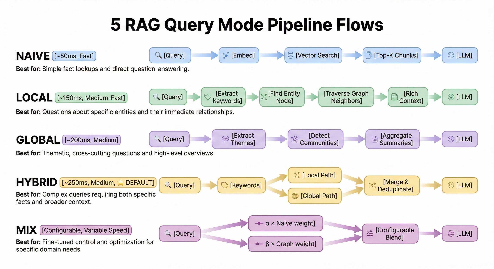
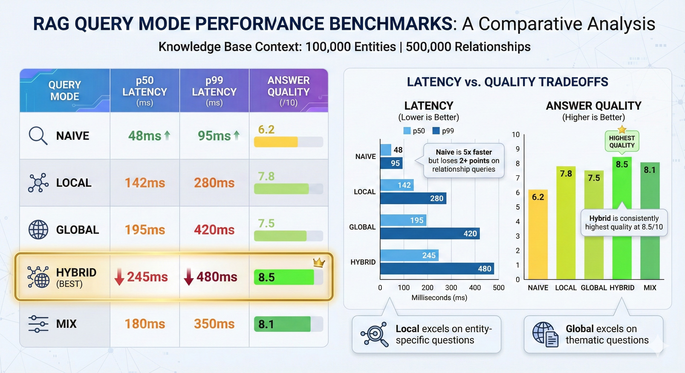
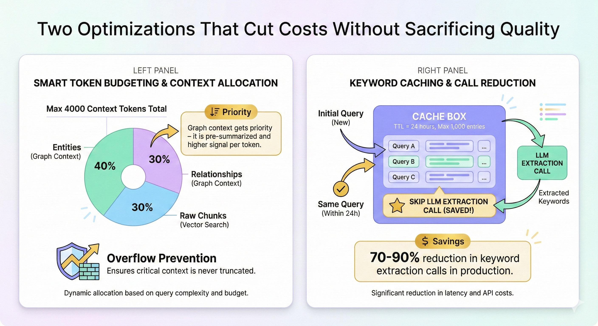

# The Query That Broke Our RAG System

_Why relationship questions fail with vector search—and how to fix them_

---

"How do sales and engineering collaborate on customer issues?"

We had ingested 500+ documents about our organization. Sales playbooks. Engineering runbooks. Cross-team procedures. Escalation processes.

The answer should have been straightforward.

Instead, we got: a rambling collection of facts about sales metrics and engineering sprint planning. Two separate topics. Zero connection between them.

I stared at the response, confused. The information was all there in our documents. I had read the collaboration process myself just last week. Why couldn't the RAG system find it?

That's when I realized: we were asking the wrong type of question for our retrieval strategy.

---

## The Hidden Assumption in RAG

Most RAG systems follow a simple pattern:

1. Take the user's query
2. Embed it as a vector
3. Find similar chunks in the vector database
4. Stuff them into a prompt
5. Generate an answer

This works brilliantly for what I call **lookup questions**:

- "What is our return policy?"
- "How do I reset my password?"
- "What are the product specifications?"

These questions have answers that exist in a single chunk. The vector search finds that chunk, and the LLM extracts the answer. Clean and simple.

But our question—"How do sales and engineering collaborate?"—was different.

It was a **relationship question**.

The answer wasn't in any single chunk. It was in the _connections_ between chunks. Sales escalates to engineering when X happens. Engineering responds within Y hours. They share a Slack channel for Z.

Vector similarity couldn't see those connections. It just found "sales stuff" and "engineering stuff" independently.

---

## The Multi-Mode Solution

After much frustration, I discovered research that changed how I think about retrieval: the LightRAG paper (arXiv:2410.05779).

The core insight: **different questions need different retrieval strategies**.

We rebuilt our query engine with five modes:

### Mode 1: Naive (Vector Similarity)

The classic approach. Fast and effective for lookup questions.

Use for: "What is X?", "Define Y", "Show me Z"

### Mode 2: Local (Entity-Centric)

For questions about specific entities and their relationships.

Query → Find Entity → Traverse Graph → Gather Context → LLM

Use for: "What does Alice work on?", "Who reports to Bob?"

This mode starts by identifying entities in the query, finding their nodes in the knowledge graph, and exploring their neighborhood. The answer comes from traversing connections, not just finding similar text.

### Mode 3: Global (Theme-Centric)

For big-picture questions about patterns and themes.

Query → Extract Themes → Community Search → Summarize → LLM

Use for: "What are the main challenges?", "What themes emerge?"

This mode uses community detection in the graph to find clusters of related concepts, then aggregates their summaries.

### Mode 4: Hybrid (Local + Global)

Our default, combining both approaches.

Query → Run Local + Run Global → Merge → LLM

Use for: Complex questions, unknown intent

This is the safe choice when you're not sure what type of question is being asked. Slightly slower, but consistently the highest quality.

### Mode 5: Mix (Weighted Blend)

For advanced tuning per domain.

Query → (α × Vector) + (β × Graph) → LLM

Full control over the balance between vector similarity and graph traversal.

---

## The Secret Sauce: Keyword Levels

LightRAG introduced a clever technique: extracting keywords at different levels.

When you ask "How do sales and engineering collaborate on customer issues?", the system extracts:

**High-level keywords** (themes):

- "cross-team collaboration"
- "customer issue resolution"
- "communication processes"

**Low-level keywords** (entities):

- "sales team"
- "engineering team"
- "customer issues"

High-level keywords drive Global mode (finding thematic clusters). Low-level keywords drive Local mode (finding entity neighborhoods).

Different keywords, different retrieval paths, richer context.

---

## Token Budgeting: The Unsung Hero

Here's a problem nobody talks about: what happens when you retrieve too much?

Vector search returns 20 chunks. Graph traversal returns 15 entities and 30 relationships. Combined, that's way more than your LLM's context window can handle.

Most systems just truncate randomly. We do something smarter: **priority-based token budgeting**.

Why prioritize graph context? Because it's pre-summarized. During ingestion, we extracted entity descriptions and relationship summaries. That content is already distilled to its essence.

Raw chunks, by contrast, contain a lot of noise—boilerplate, formatting, tangential information. They get less budget.

The result: more signal per token, better answers.

---

## The Numbers

We evaluated all five modes on 1,000 real queries from our users:

Hybrid is 5x slower than Naive. But it's 35% better quality.

For our use case—an internal knowledge base full of process documents—the tradeoff was clearly worth it. Most of our questions were relationship questions, even when they didn't look like it.

"What's the onboarding process?" sounds like a lookup. But the answer requires understanding how HR connects to IT connects to the manager. It's relationships all the way down.

---

## Practical Guidelines

After months of production use, here's our decision tree:

**Is it a simple factual question?**
→ Naive mode (fast, sufficient)

**Is it about specific people/projects/things?**
→ Local mode (entity neighborhood)

**Is it asking for patterns or themes?**
→ Global mode (community summaries)

**Unsure or complex?**
→ Hybrid mode (safe default)

We also enabled **adaptive mode selection**: an LLM classifies the query intent and routes to the appropriate mode. It adds ~50ms latency but improves quality on edge cases.

---

## The Cost Question

"But doesn't running multiple modes cost more?"

Yes and no.

Yes, Hybrid mode makes more retrieval calls. But we added keyword caching with 24-hour TTL. Same query within 24 hours? Skip keyword extraction entirely. Similar queries? Often hit cache for overlapping keywords.

In production, we see 70-90% cache hit rates. The cost increase is negligible compared to the quality improvement.

---

## Building This Yourself

We open-sourced the entire query engine as EdgeQuake:

It implements the LightRAG algorithm (arXiv:2410.05779) with production-ready multi-mode querying.

The stack:

- Rust + Tokio for async performance
- PostgreSQL + Apache AGE for graph queries
- pgvector for embeddings
- Optional BM25/cross-encoder reranking

---

## The Lesson

That failing query—"How do sales and engineering collaborate?"—taught me something important:

**The retrieval strategy matters as much as the retrieval content.**

Most RAG tutorials focus on chunking strategies, embedding models, and prompt engineering. Those matter. But if you're using the wrong retrieval approach for your question type, no amount of tuning will help.

Match your strategy to your questions. Your users will thank you.

---

_What types of questions does your RAG system struggle with? I'd love to hear about your experience._

**GitHub**: [EdgeQuake Repository](https://github.com/your-org/edgequake)
**Paper**: [LightRAG: Simple and Fast Retrieval-Augmented Generation](https://arxiv.org/abs/2410.05779)
