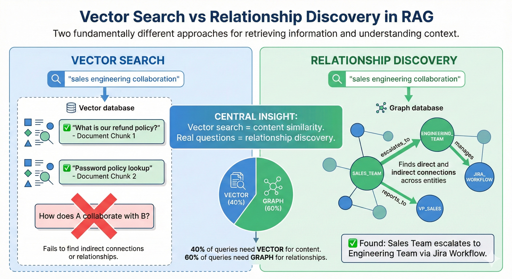
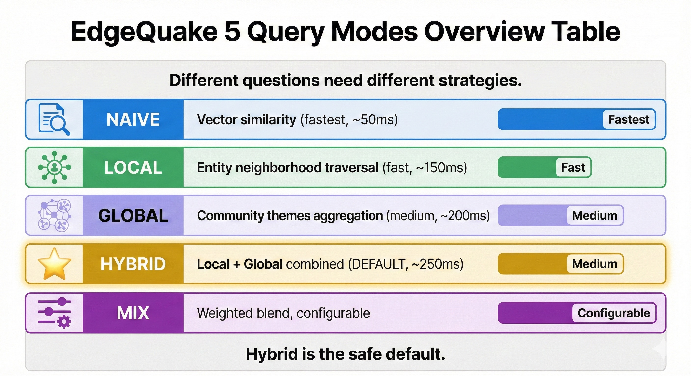

# Thread: Why Your RAG Answers Suck (And How to Fix It) 🧵

## Tweet 1

"How do sales and engineering collaborate?"

500+ documents ingested.
RAG had all the information.

The answer: random facts about sales metrics and engineering sprints.

No connection. No relationship.

Why vector search fails at relationship questions: 🧵

---

## Tweet 2

Vector similarity finds similar chunks.

Query: "sales engineering collaboration"

Finds:

- Chunk about sales processes
- Chunk about engineering workflows

Missing: THE RELATIONSHIP between them.

The answer requires traversing connections, not just finding similar text.

---

## Tweet 3

The fundamental problem:

"What's our refund policy?" → Vector works ✅
"How does A collaborate with B?" → Vector fails ❌

Most real-world queries are relationship questions.

---

## Tweet 4

EdgeQuake solution: 5 query modes.

Different questions need different strategies.

---

## Tweet 5

Mode 1: NAIVE (~50ms)

Best for: Factual lookups
Example: "What is our password policy?"

Fast. Simple. Works for 40% of queries.

---

## Tweet 6

Mode 2: LOCAL (~150ms)

Query → Find Entity → Traverse Graph → Context → LLM

Best for: Entity relationships
Example: "What projects has Sarah Chen led?"

Starts with SARAH_CHEN node.
Explores connections: projects, teams, reports.
Rich relationship context.

---

## Tweet 7

Mode 3: GLOBAL (~200ms)

Query → Extract Themes → Community Search → LLM

Best for: Broad patterns
Example: "What are our main organizational challenges?"

Uses community detection.
Finds clusters of related concepts.
Thematic overview.

---

## Tweet 8

Mode 4: HYBRID (~250ms) - DEFAULT

Query → [Local] + [Global] → Merge → LLM

Best for: Complex queries
Example: "How do sales and engineering collaborate?"

Combines:

- Entity precision (Local)
- Thematic coverage (Global)

Safe default for unknown query types.

---

## Tweet 9

Mode 5: MIX (configurable)

Query → (α × Naive) + (β × Graph) → LLM

Best for: Domain tuning
Example: Custom research applications

Full control over retrieval weights.
Tune α and β per use case.

---

## Tweet 10

The secret sauce: Keyword extraction.

LightRAG algorithm extracts:

High-level keywords (themes):
→ "cross-team collaboration"
→ Global mode retrieval

Low-level keywords (entities):
→ "sales team", "engineering team"
→ Local mode retrieval

Different keywords, different retrieval paths.

---

## Tweet 11

Token budgeting prevents overflow.

Graph context (entities + relationships) gets priority.

WHY? It's pre-summarized. Higher signal per token.

---

## Tweet 12

Keyword caching: 10x cost reduction.

Same query? Skip keyword extraction.
Similar queries? Often hit cache.

70-90% reduction in extraction calls.

---

## Tweet 13

Benchmarks on 1,000 queries:

Hybrid: 5x slower than Naive.
Hybrid: 35% better answers.

Worth it for relationship questions.

---

## Tweet 14

Decision tree:

Is it a factual lookup? → Naive
Is it about specific entities? → Local
Is it about themes/patterns? → Global
Unsure? → Hybrid (default)

Adaptive mode selection can do this automatically.

---

## Tweet 15

EdgeQuake is open source.

- Rust + Tokio async
- PostgreSQL + Apache AGE + pgvector
- LightRAG algorithm (arXiv:2410.05779)

🔗 github.com/your-org/edgequake

Thanks to Guo et al. for LightRAG research.
